# langchain-velatir

[](https://badge.fury.io/py/langchain-velatir)
[](https://opensource.org/licenses/MIT)
[](https://www.python.org/downloads/)

**AI Governance, Compliance, and Human-in-the-Loop for LangChain**

Official LangChain integration for [Velatir](https://velatir.com) - Add enterprise-grade governance, compliance checking, and human approval workflows to your LangChain agents.

## Features

- **🛡️ Compliance Guardrails**: Automatically validate agent responses against GDPR, EU AI Act, Bias & Fairness, and Prompt Injection policies
- **👥 Human-in-the-Loop**: Require human approval for sensitive operations before execution
- **📊 Full Audit Trail**: All decisions logged in Velatir dashboard with complete context
- **🔄 Multi-Channel Approvals**: Receive approval requests via Slack, Microsoft Teams, Email, or Web UI
- **⚡ Easy Integration**: Drop-in middleware that works with existing LangChain agents
- **🎯 Flexible Policies**: Configure which tools need approval and which policies to enforce

## Installation

```bash
pip install langchain-velatir
```

**Requirements:**
- Python 3.10+
- LangChain 1.0 alpha or later
- Velatir account and API key ([sign up here](https://velatir.com))

## Quick Start

### Guardrails Example

Add governance to your agent responses. Velatir automatically evaluates responses against your configured policies:

```python
from langchain_velatir import VelatirGuardrailMiddleware
from langchain.agents import create_react_agent

# Create guardrail middleware
# Policies (GDPR, EU AI Act, Bias & Fairness, etc.) are configured in Velatir dashboard
guardrails = VelatirGuardrailMiddleware(
    api_key="your-velatir-api-key",
    mode="blocking",  # Block responses that Velatir denies
)

# Add to your agent
agent = create_react_agent(
    model,
    tools,
    middleware=[guardrails]
)
```

### Human-in-the-Loop Example

Send tool calls to Velatir for evaluation. Velatir determines if human approval is needed based on your configured flows:

```python
from langchain_velatir import VelatirHITLMiddleware
from langchain.agents import create_react_agent

# Create HITL middleware
# Approval flows and routing are configured in Velatir dashboard
hitl = VelatirHITLMiddleware(
    api_key="your-velatir-api-key",
    polling_interval=5.0,
    timeout=600.0,  # 10 minutes max wait
    require_approval_for=["delete_user", "execute_payment"],  # Optional filter
)

# Add to your agent
agent = create_react_agent(
    model,
    tools,
    middleware=[hitl]
)
```

### Combined Guardrails + HITL

Use both for complete governance. All policies and flows are configured in your Velatir dashboard:

```python
from langchain_velatir import VelatirGuardrailMiddleware, VelatirHITLMiddleware

# Guardrails evaluate responses AFTER agent generates them
guardrails = VelatirGuardrailMiddleware(
    api_key="your-api-key",
    mode="blocking",
)

# HITL evaluates tool calls BEFORE execution
hitl = VelatirHITLMiddleware(
    api_key="your-api-key",
    require_approval_for=["process_payment", "delete_data"],  # Optional filter
)

# Add both to your agent
agent = create_react_agent(
    model,
    tools,
    middleware=[hitl, guardrails]  # Order matters: HITL first, then guardrails
)
```

## How It Works

### VelatirGuardrailMiddleware

Follows the pattern of LangChain's `SafetyGuardrailMiddleware`:

1. Uses `after_agent` hook to intercept agent responses
2. Sends responses to Velatir API for evaluation
3. Velatir's backend evaluates against your configured policies and flows:
   - GDPR compliance checking
   - EU AI Act requirements
   - Bias & Fairness detection
   - Prompt Injection prevention
   - Custom policies you've configured
4. Velatir returns decision (approved/denied/requires intervention)
5. Middleware blocks or logs based on mode

**Policy Configuration:**
All policies are configured in your Velatir dashboard, not in code. This allows non-technical stakeholders to manage compliance requirements without code changes.

**Modes:**
- `blocking` - Block responses that Velatir denies (default)
- `logging` - Log Velatir's decisions but allow execution

### VelatirHITLMiddleware

Implements human-in-the-loop approval workflows:

1. Uses `modify_model_request` hook to intercept tool calls
2. Sends tool calls to Velatir API for evaluation
3. Velatir's backend evaluates tool calls against your configured flows:
   - Determines risk level
   - Decides if human approval is needed
   - Routes to appropriate reviewers (Slack, Teams, Email, Web)
   - May approve instantly for low-risk actions
4. Pauses execution if human review is required
5. Polls for Velatir's decision
6. Executes or blocks based on decision

**Flow Configuration:**
All flows (when to require approval, who to route to, how many approvals, escalation paths) are configured in your Velatir dashboard. You can update flows without changing code.

**Decision Types:**
- ✅ **Approved** - Tool executes normally (may be instant or after human review)
- ❌ **Rejected** - Tool execution blocked, raises `VelatirApprovalDeniedError`
- 📝 **Change Requested** - Feedback provided, execution blocked

## Configuration

### Guardrail Middleware Options

```python
VelatirGuardrailMiddleware(
    api_key="your-api-key",                        # Required: Velatir API key
    mode="blocking",                                # "blocking" or "logging"
    base_url=None,                                  # Optional: Custom API URL
    timeout=10.0,                                   # API request timeout in seconds
    approval_timeout=30.0,                          # Max wait for Velatir decision
    polling_interval=2.0,                           # Seconds between polling
    blocked_message="Response requires review...",  # Message shown when blocked
    metadata={},                                    # Optional metadata for all tasks
)
```

### HITL Middleware Options

```python
VelatirHITLMiddleware(
    api_key="your-api-key",              # Required: Velatir API key
    base_url=None,                        # Optional: Custom API URL
    polling_interval=5.0,                 # Seconds between polling
    timeout=600.0,                        # Max wait time for approval
    require_approval_for=["tool1"],       # Optional: filter which tools to send (None = all)
    metadata={},                          # Optional metadata for all tasks
)
```

## Error Handling

The middleware raises custom exceptions for different scenarios:

```python
from langchain_velatir import (
    VelatirPolicyViolationError,
    VelatirApprovalDeniedError,
    VelatirTimeoutError,
)

try:
    result = agent.invoke({"input": "Process customer data"})
except VelatirPolicyViolationError as e:
    print(f"Policy violation: {e.violated_policies}")
    print(f"Review task: {e.review_task_id}")
except VelatirApprovalDeniedError as e:
    print(f"Approval denied: {e.requested_change}")
    print(f"Review task: {e.review_task_id}")
except VelatirTimeoutError as e:
    print(f"Timeout after {e.timeout_seconds}s")
    print(f"Review task: {e.review_task_id}")
```

## Examples

See the `examples/` directory for complete examples:

- **`example_guardrails.py`** - Compliance checking with guardrails
- **`example_hitl.py`** - Human approval workflows
- **`example_combined.py`** - Both guardrails and HITL together

Run examples:

```bash
export VELATIR_API_KEY="your-api-key"
export OPENAI_API_KEY="your-openai-key"
python examples/example_guardrails.py
```

## Architecture

### Middleware Integration

```mermaid
flowchart TD
    A[1. User Input] --> B[2. VelatirHITLMiddleware<br/>modify_model_request hook<br/>→ Request human approval<br/>→ Poll for decision]
    B --> C[3. Tool Execution<br/>if approved]
    C --> D[4. Agent Response<br/>Generation]
    D --> E[5. VelatirGuardrailMiddleware<br/>after_agent hook<br/>→ Validate against policies<br/>→ Block if violations found]
    E --> F[6. Final Response<br/>to User]

    style A fill:#e1f5ff
    style B fill:#fff4e1
    style C fill:#e8f5e9
    style D fill:#e8f5e9
    style E fill:#fff4e1
    style F fill:#e1f5ff
```



### Velatir Integration Flow

```mermaid
graph LR
    A[LangChain<br/>Middleware] -->|HTTP| B[Velatir<br/>API Server]
    B --> C[Policy Engine<br/>• GDPR<br/>• EU AI Act<br/>• Bias & Fairness]
    B --> D[Approval Channels<br/>• Slack<br/>• Teams<br/>• Email<br/>• Web]
    D --> E[Human Decision<br/>Approve/Deny]
    E -->|Decision| B
    C -->|Evaluation| F[Decision Logged<br/>in Velatir]

    style A fill:#e1f5ff
    style B fill:#fff4e1
    style C fill:#ffe8e8
    style D fill:#e8f5e9
    style E fill:#f3e5f5
    style F fill:#fff9c4
```



## Best Practices

### 1. Layer Your Protections

```python
# HITL for high-risk actions (before execution)
hitl = VelatirHITLMiddleware(
    api_key=api_key,
    require_approval_for=["delete_data", "execute_payment", "modify_user"],
)

# Guardrails for compliance (after generation)
# Policies are configured in Velatir dashboard
guardrails = VelatirGuardrailMiddleware(
    api_key=api_key,
    mode="blocking",
)

# Apply both
agent = create_react_agent(model, tools, middleware=[hitl, guardrails])
```

### 2. Use Appropriate Modes

```python
# Production: Block violations
guardrails = VelatirGuardrailMiddleware(
    api_key=api_key,
    mode="blocking",  # Strict enforcement
)

# Development: Log for analysis
guardrails = VelatirGuardrailMiddleware(
    api_key=api_key,
    mode="logging",  # Monitor without blocking
)
```

### 3. Configure Timeouts Appropriately

```python
# Quick operations: Short timeout
hitl = VelatirHITLMiddleware(
    api_key=api_key,
    timeout=300.0,  # 5 minutes
    polling_interval=3.0,
)

# Critical decisions: Longer timeout
hitl = VelatirHITLMiddleware(
    api_key=api_key,
    timeout=1800.0,  # 30 minutes
    polling_interval=10.0,
)
```

### 4. Selective Tool Approval

```python
# Only require approval for sensitive tools
hitl = VelatirHITLMiddleware(
    api_key=api_key,
    require_approval_for=[
        "delete_user",
        "process_payment",
        "access_confidential_data",
    ],
)
# Other tools execute without approval
```

## Use Cases

### Financial Services

```python
# Configure EU AI Act and Bias policies in Velatir dashboard
guardrails = VelatirGuardrailMiddleware(
    api_key=api_key,
    mode="blocking",
)

# Configure approval flows for financial operations in dashboard
hitl = VelatirHITLMiddleware(
    api_key=api_key,
    require_approval_for=["execute_trade", "approve_loan", "process_withdrawal"],
)
```

### Healthcare

```python
# Configure GDPR, Bias, and custom HIPAA policies in Velatir dashboard
guardrails = VelatirGuardrailMiddleware(
    api_key=api_key,
    mode="blocking",
)

# Configure approval flows for medical operations in dashboard
hitl = VelatirHITLMiddleware(
    api_key=api_key,
    require_approval_for=["access_patient_records", "prescribe_medication"],
)
```

### Customer Support

```python
# Configure Bias and Prompt Injection policies in Velatir dashboard
guardrails = VelatirGuardrailMiddleware(
    api_key=api_key,
    mode="blocking",
)

# Configure approval flows for customer actions in dashboard
hitl = VelatirHITLMiddleware(
    api_key=api_key,
    require_approval_for=["issue_refund", "close_account", "escalate_complaint"],
)
```

## Velatir Dashboard

All review tasks, policy violations, and approvals are logged in your Velatir dashboard:

- **Real-time monitoring** of agent decisions
- **Audit trail** for compliance reporting
- **Analytics** on approval patterns and policy violations
- **Team management** for approval workflows
- **Custom policies** tailored to your industry

Visit [velatir.com](https://www.velatir.com) to set up your dashboard.

## Development

### Running Tests

```bash
pip install -e ".[dev]"
pytest tests/
```

### Code Formatting

```bash
black langchain_velatir/
ruff check langchain_velatir/
```

### Type Checking

```bash
mypy langchain_velatir/
```

## Contributing

We welcome contributions! Please see our [Contributing Guide](CONTRIBUTING.md) for details.

## Support

- 📖 [Documentation](https://www.velatir.com/docs)
- 🐛 [Report Issues](https://github.com/velatir/langchain-velatir/issues)
- 📧 [Email Support](mailto:hello@velatir.com)

## License

MIT License - see [LICENSE](LICENSE) file for details.

---

Made with ❤️ by [Velatir](https://velatir.com) | Enabling safe AI adoption at scale
